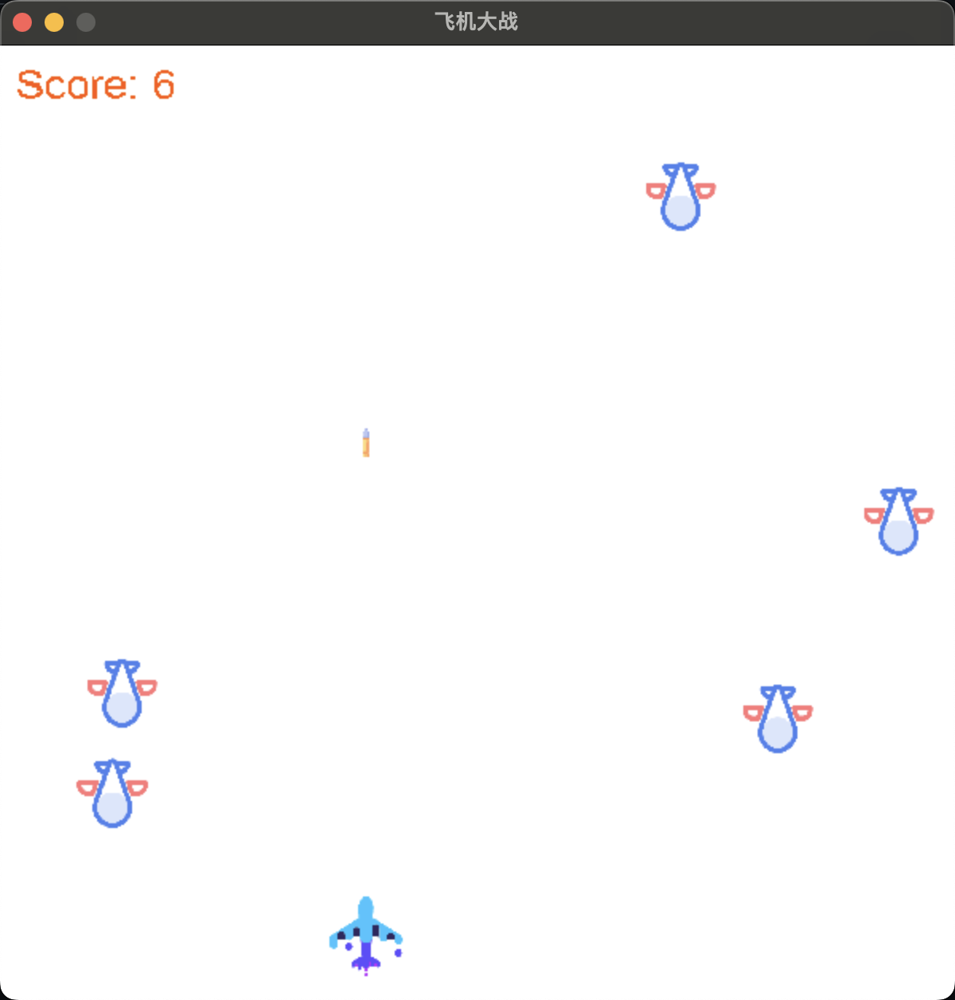

# Plane Wars


## 🎮 What's that
Use Go and ChatGPT to achieve a simple Plane Wars. The V2 version uses an interactive window with simple functions such as shooting score, collision game end, etc

## 🚀 Installation
```bash
go get -v github.com/veandco/go-sdl2/sdl
go get -v github.com/veandco/go-sdl2/ttf
```

## 💻 How to run
```bash
go run ./planewarsv2.go
```

## 🤝 Thanks
This is the first small open source project done, please give relevant suggestions if you have questions or optimizations